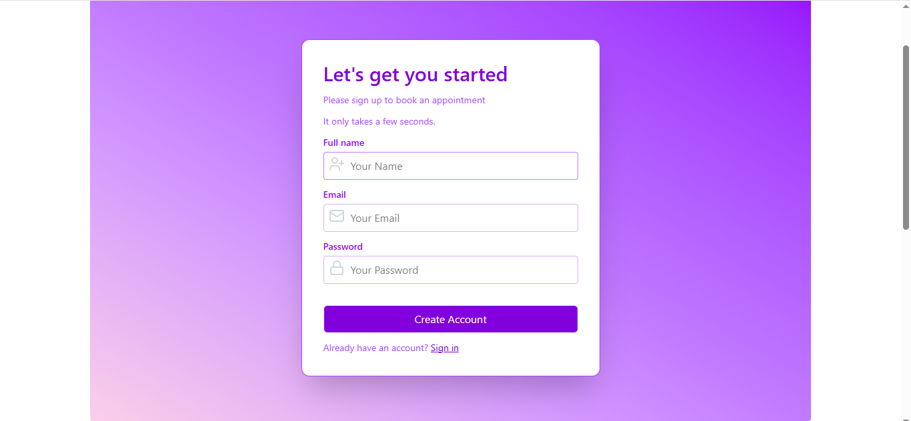
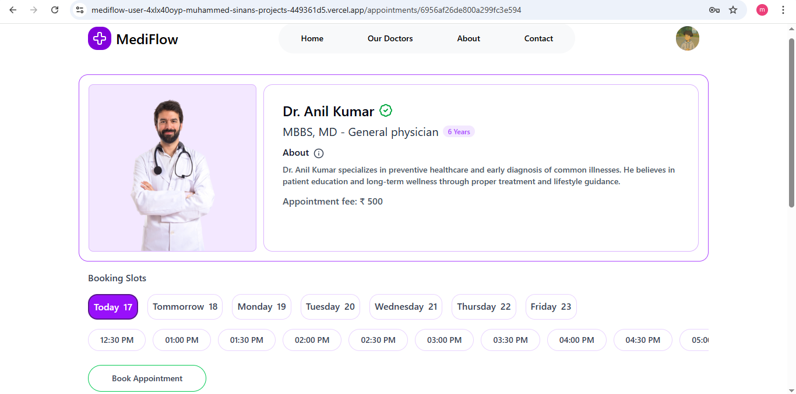
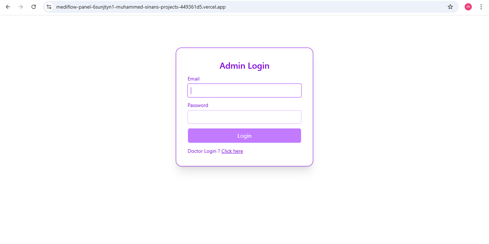
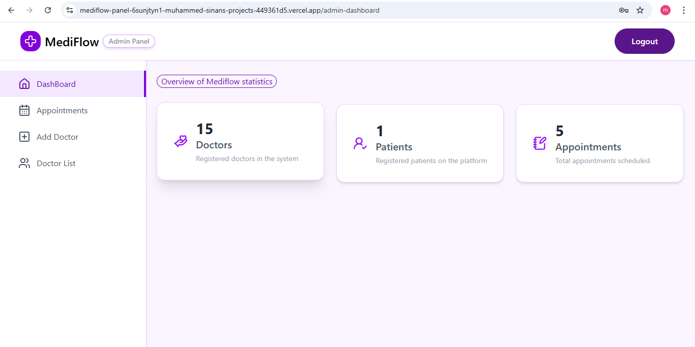
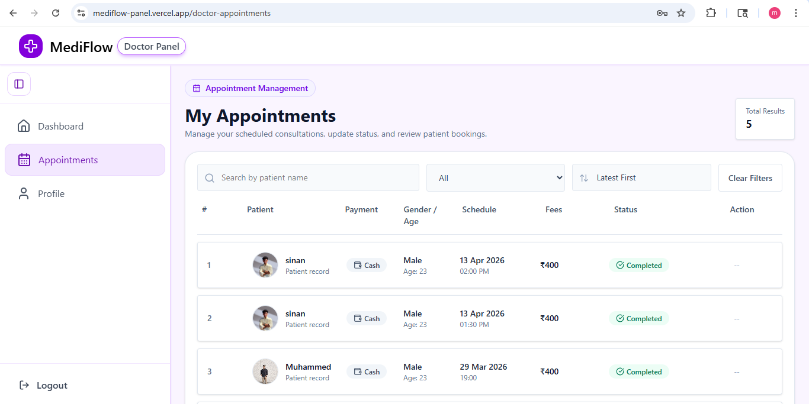

# MEDIFLOW 

MediFlow is a modern hospital management system that allows patients to book doctor appointments, doctors to manage their appointments, and admins to oversee the system efficiently. It provides a secure, role based web application to simplify hospital workflow.

## OVERVIEW 

MediFlow provides a seamless experience for patients, doctors, and administrators:

- Patients can book appointments with doctors based on specialty, time slots, and dates.
- Doctors can manage their appointments, track patients, and view earnings.
- Admins can manage doctors, appointments, and overall system statistics.
- The platform uses secure login, OTP/email verification, and JWT authentication to protect user data.

## Problem Statement 

 Manual hospital management is often inefficient:

- Difficulty tracking appointments
- Confusion between doctor, admin, and patient roles
- Delays in payments and appointment confirmation
- Limited visibility into doctor availability and hospital operations

 MediFlow solves these problems by providing a structured, role-based, and secure system.

## Features 

### Patient/User

* Secure login/signup with email verification and OTP
* Book doctor appointments by specialty, date, and time slot
* View all booked appointments in the dashboard
* Online payment option
* Update profile, personal info, and address

### Doctor

* Special login session
* View assigned patient appointments
* Dashboard with number of appointments, patients, and earnings
* Dashboard with statistics: number of users and appointments

### Admin

* Add, edit, or remove doctors
* View all appointments and users
* Cancel appointments if required
* Dashboard with statistics: number of users, doctors, and appointments

## Tech Stack 

* **Frontend:** React.js, Tailwind CSS, Framer Motion
* **Backend:** Node.js, Express.js
* **Database:** MongoDB
* **Authentication:** JWT (JSON Web Token)
* **Deployment:** Vercel (Frontend), Render (Backend) 

## INSTALLATION ##

* Clone the repository <repo-url> 
* Install backend dependencies
  cd backend 
  npm install
  npm start
* Install frontend dependencies 
  cd frontend
  npm install
  npm run dev

## Screenshots

### Login Page

### Home Page

### Doctors Page

### Booking Page

### Admin Login

### Admin dashboard

### Admin Appointments

### Doctor dashboard

### Doctor Appointments

